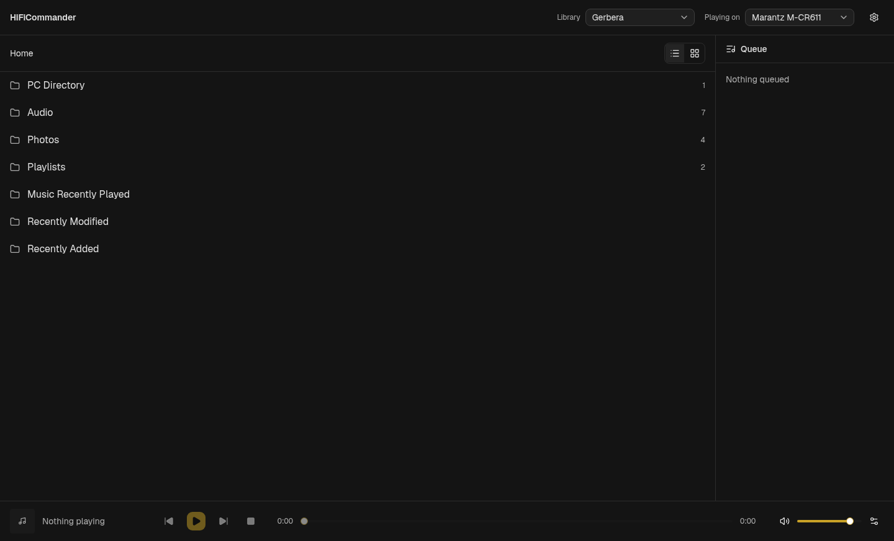
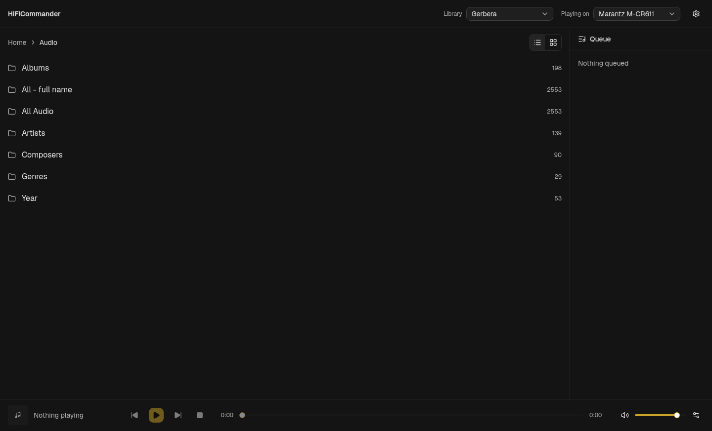
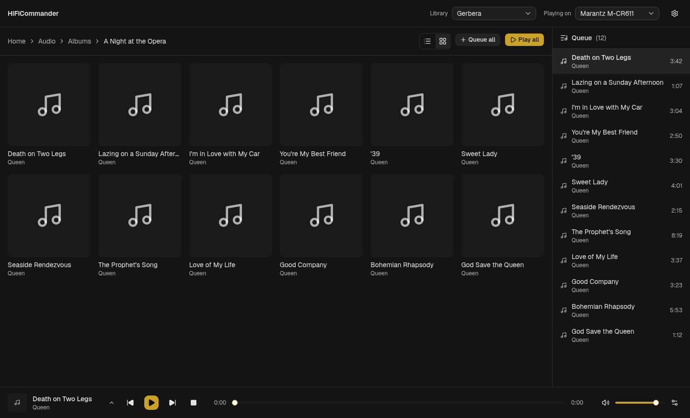
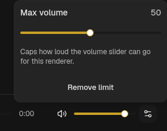

# HiFiCommander

Web UI + API to browse UPnP/DLNA media servers and control renderers on your
LAN.

**This is not a media server.** It doesn't store or serve files — it's a
*control point*: it discovers a MediaServer and MediaRenderer already on your
network via SSDP and gives you a UI to browse the server's library and drive
the renderer (play/pause/seek/volume/queue). You still need something
actually serving your media, e.g. [Gerbera](https://gerbera.io/) or
[MiniDLNA](https://sourceforge.net/projects/minidlna/) — this app just talks
to it.

## Screenshots

|                                          |                                                |
| ---------------------------------------- | ---------------------------------------------- |
|    |  |
|  |  |

## Features

- **Discovery + pinning** — auto-discovers servers/renderers via SSDP; devices
  that don't reliably answer M-SEARCH can be pinned by their description URL
  instead, bypassing discovery entirely.
- **Browse** — folder/album/artist browsing over ContentDirectory, with list
  and grid views, filtering, and an alphabet jump strip for long lists.
- **Playback control** — play, pause, seek, and a queue with auto-advance
  (polls transport state and moves to the next track when one ends).
- **Volume limiting** — cap the max volume a renderer's slider can reach,
  independent of the renderer's own volume control.
- **Live updates** — device list and queue state push over WebSocket.

## Requirements

You need an existing UPnP MediaServer (Gerbera, MiniDLNA, Plex's DLNA server,
etc.) and at least one UPnP/DLNA MediaRenderer on the same LAN.

## Running it

### Node

```bash
npm install          # installs server + web workspaces
npm run dev           # server on :3000, web dev server with hot reload
# or, for a production build served by the API:
npm start
```

### Docker

```bash
docker compose up -d --build
```

SSDP discovery needs multicast and a fixed UDP port (1900), which Docker's
default bridge network NATs away — `docker-compose.yml` already sets
`network_mode: host` so discovery works. If you adapt the compose file,
keep that setting (or pre-pin your devices to sidestep discovery entirely).

Renderer/server data (pinned devices, volume limits) persists in
`server/data/`, mounted as a volume in the compose file.

## Discord rich presence

Optional: shows the current track as your Discord activity. Create an
application at <https://discord.com/developers/applications>, copy its
Application ID into `.env` as `DISCORD_CLIENT_ID` (see `.env.example`),
and restart. Works with the official client and with Vesktop/arRPC (enable
Rich Presence in Vesktop settings). For an image on the activity card,
upload an art asset named `cover` under the application's Rich Presence
assets. The compose file mounts the host runtime dir so the container can
reach the IPC socket; presence is skipped entirely when `DISCORD_CLIENT_ID`
is unset or Discord isn't running.

## Pinning a device manually

If a device won't show up via discovery, add its description XML URL to
`server/data/pinned-devices.json` before starting (see
`pinned-devices.example.json` for the format), or pin it from the UI once
running.
